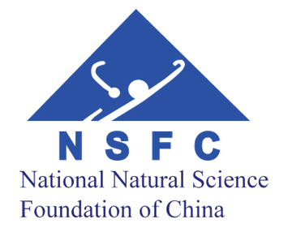
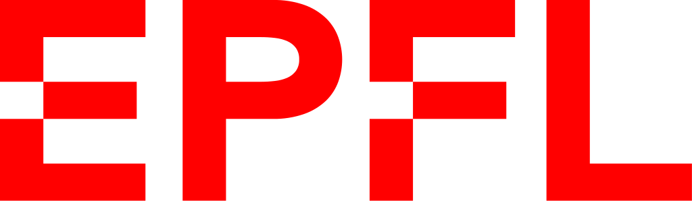

# Domain Shifts in White Matter Fiber Estimation

[](https://github.com/Medical-Image-Analysis-Laboratory/dl_fiber_domain_shift)
[](https://doi.org/10.1109/ISBI56570.2024.10635347)
[](https://doi.org/10.48550/arXiv.2409.01195)

This repository contains the code for the papers:

- **"[Cross-age and cross-site domain shift impacts on deep learning-based white matter fiber estimation in newborn and baby brains](https://arxiv.org/abs/2312.14773)"** by Rizhong Lin, Ali Gholipour, Jean-Philippe Thiran, Davood Karimi, Hamza Kebiri*, and Meritxell Bach Cuadra*, ISBI 2024.
- **"[Ground-truth effects in learning-based fiber orientation distribution estimation in neonatal brains](http://arxiv.org/abs/2409.01195)"** by Rizhong Lin*, Hamza Kebiri*, Ali Gholipour, Yufei Chen, Jean-Philippe Thiran, Davood Karimi, and Meritxell Bach Cuadra, CDMRI 2024.
<!-- - **"Tentative title"** by Rizhong Lin*, Hamza Kebiri*, Ali Gholipour, Yufei Chen, Jean-Philippe Thiran, Davood Karimi, and Meritxell Bach Cuadra, in preparation. -->

\* Equal contribution

## Structure

- [`MethodOfMoments`](./MethodOfMoments): Implementation of the Method of Moments (MoM) for harmonizing diffusion MRI data across different sites. The method is described in:
  - K. M. Huynh, G. Chen, Y. Wu, D. Shen, and P.-T. Yap, "Multi-Site Harmonization of Diffusion MRI Data via Method of Moments," _IEEE Transactions on Medical Imaging_, vol. 38, no. 7, pp. 1599–1609, Jul. 2019, doi: 10.1109/TMI.2019.2895020.
- [`DeepLearning`](./DeepLearning):
  - [`karimi_learning_2021`](./DeepLearning/karimi_learning_2021): MLP model for estimating the fiber orientation distribution function (fODF) from diffusion-weighted MRI, described in:
    - D. Karimi, L. Vasung, C. Jaimes, F. Machado-Rivas, S. K. Warfield, and A. Gholipour, "Learning to estimate the fiber orientation distribution function from diffusion-weighted MRI," _NeuroImage_, vol. 239, p. 118316, Oct. 2021, doi: 10.1016/j.neuroimage.2021.118316.
  - [`hosseini_cttrack_2022`](./DeepLearning/hosseini_cttrack_2022): CTtrack model for fiber orientation estimation and tractography, described in:
    - S. M. Hossein Hosseini, "CTtrack: A CNN+Transformer-based framework for fiber orientation estimation & tractography," _Neuroscience Informatics_, 2022.
  - [`kebiri_robust_2023`](./DeepLearning/kebiri_robust_2023): Deep learning model for white matter fiber estimation in newborn and baby brains, described in:
    - H. Kebiri, A. Gholipour, R. Lin, L. Vasung, D. Karimi, and M. Bach Cuadra, "Robust Estimation of the Microstructure of the Early Developing Brain Using Deep Learning," in _26th International Conference on Medical Image Computing and Computer Assisted Intervention -- MICCAI 2023_, Oct. 2023, pp. 293–303, doi: 10.1007/978-3-031-43990-2_28.
    - H. Kebiri, A. Gholipour, R. Lin, L. Vasung, C. Calixto, Ž. Krsnik, D. Karimi, and M. Bach Cuadra, "Deep learning microstructure estimation of developing brains from diffusion MRI: A newborn and fetal study," _Medical Image Analysis_, vol. 95, p. 103186, Jul. 2024, doi: 10.1016/j.media.2024.103186.
  - [`kebiri_robust_2023_pytorch`](./DeepLearning/kebiri_robust_2023_pytorch): PyTorch implementation of the deep learning model for white matter fiber estimation in newborn and baby brains presented in `kebiri_robust_2023`.

## Data

The data used in this study are from the Developing Human Connectome Project (dHCP) and the Baby Connectome Project (BCP). The dHCP data are available at https://www.humanconnectome.org/study/lifespan-developing-human-connectome-project, and the BCP data are available at https://www.humanconnectome.org/study/lifespan-baby-connectome-project.

## Citation

If you find our work useful in your research, please consider citing our papers:

```bibtex
@inproceedings{lin_cross-age_2024,
  title     = {Cross-{Age} and {Cross}-{Site} {Domain} {Shift} {Impacts} on {Deep} {Learning}-{Based} {White} {Matter} {Fiber} {Estimation} in {Newborn} and {Baby} {Brains}},
  doi       = {10.1109/ISBI56570.2024.10635347},
  author    = {Lin, Rizhong and Gholipour, Ali and Thiran, Jean-Philippe and Karimi, Davood and Kebiri, Hamza and Bach Cuadra, Meritxell},
  year      = 2024,
  month     = may,
  booktitle = {21st {IEEE} {International} {Symposium} on {Biomedical} {Imaging} ({ISBI})}
}

@inproceedings{lin_ground-truth_2024,
  title     = {Ground-truth effects in learning-based fiber orientation distribution estimation in neonatal brains},
  url       = {https://arxiv.org/abs/2409.01195},
  doi       = {10.48550/arXiv.2409.01195},
  author    = {Lin, Rizhong and Kebiri, Hamza and Gholipour, Ali and Chen, Yufei and Thiran, Jean-Philippe and Karimi, Davood and Bach Cuadra, Meritxell},
  year      = 2024,
  month     = oct,
  booktitle = {MICCAI Workshop on Computational Diffusion MRI (CDMRI) 2024}
}

@article{kebiri_deep_2024,
  title   = {Deep learning microstructure estimation of developing brains from diffusion {MRI}: A newborn and fetal study},
  url     = {https://www.sciencedirect.com/science/article/abs/pii/S1361841524001117},
  doi     = {10.1016/j.media.2024.103186},
  author  = {Kebiri, Hamza and Gholipour, Ali and Lin, Rizhong and Vasung, Lana and Calixto, Camilo and Krsnik, Željka and Karimi, Davood and Bach Cuadra, Meritxell},
  year    = {2024},
  month   = jul,
  journal = {Medical Image Analysis},
  volume  = {95},
  pages   = {103186},
  issn    = {1361-8415},
}

@inproceedings{kebiri_robust_2023,
  title     = {Robust {Estimation} of the {Microstructure} of the {Early} {Developing} {Brain} {Using} {Deep} {Learning}},
  url       = {http://link.springer.com/chapter/10.1007/978-3-031-43990-2_28},
  doi       = {10.1007/978-3-031-43990-2_28},
  author    = {Kebiri, Hamza and Gholipour, Ali and Lin, Rizhong and Vasung, Lana and Karimi, Davood and Bach Cuadra, Meritxell},
  year      = 2023,
  month     = oct,
  booktitle = {26th {International} {Conference} on {Medical} {Image} {Computing} and {Computer} {Assisted} {Intervention} -- {MICCAI} 2023},
  pages     = {293--303}
}
```

## Acknowledgements

<table align="center" width="100%">
  <tr align="center">
    <td width="25%"></td>
    <td width="25%"></td>
    <td width="15%"></td>
    <td width="35%"></td>
  </tr>
</table>

<table align="center" width="100%">
  <tr align="center">
    <td width="16.6%"></td>
    <td width="16.6%"></td>
    <td width="16.6%"></td>
    <td width="16.6%"></td>
    <td width="16.6%"></td>
    <td width="16.6%"></td>
  </tr>
</table>

We gratefully acknowledge access to the facilities and expertise of the CIBM Center for Biomedical Imaging (Centre d'Imagerie BioMédicale), a Swiss research center of excellence founded and supported by Lausanne University Hospital (CHUV), University of Lausanne (UNIL), École Polytechnique Fédérale de Lausanne (EPFL), University of Geneva (UNIGE), Geneva University Hospitals (HUG), and the Leenaards and Jeantet Foundations.

This research was supported by grants from the Swiss National Science Foundation (grants 182602 and 215641); the U.S. National Institutes of Health, including awards from the National Institute of Neurological Disorders and Stroke (R01NS128281) and the Eunice Kennedy Shriver National Institute of Child Health and Human Development (R01HD110772); and the National Natural Science Foundation of China (grants 62173252 and 62472315).

## Contact

Please feel free to contact us if you have any questions or comments:

```python
# Contact email addresses
[
    'rizhong.lin@$.#'.replace('$', 'epfl').replace('#', 'ch'),
    'hamza.kebiri@$.#'.replace('$', 'unil').replace('#', 'ch')
]
```
